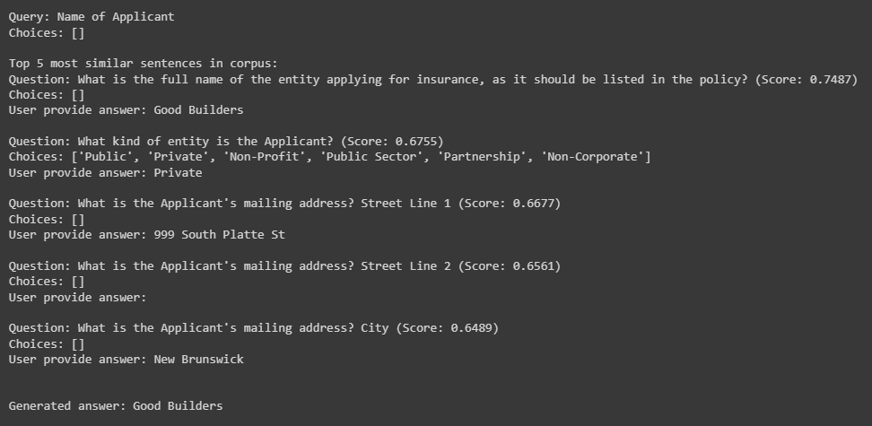

### Task Background

We have provided two folders, each containing two PDFs. 
- The first file is a company's application for insurance. This application is created by Limit. ("Limit Application")
  It contains several questions and answers about the company.
- The second file is the same company's application for insurance, but generated by a different insurance firm. ("Second Application")
  It also contains several questions and answers about the company.

The questions (or answers) are not always the same. The problem that you are trying to solve is that given one insurance application,
you want to fill out another insurance application, but the questions may have differences. For example, one application may ask:
- "What is the company's predicted revenue for 2024?"
And another application might ask:
- "What was the company's revenue for 2023?"
Practically, the answers to both questions will be the same number. (It would not be feasible for the company to answer
many different variations of the same question.)

### Task

You are to write code that performs the following:

**Input**
Accept a Limit Application and a Second Application. (The Second Application may or may not have answers in it.)
These will be supplied as sequential command-line arguments, e.g. `python3 application-01-input.pdf application-02-output.pdf`

**Processing**
Extract the questions and answers in the Limit Application, and just the questions in the Second Application.
Using the answers in the Limit Application, create answers to the questions in the Second Application.

**Output**
A textfile listing all the questions in the second application, and appropriate answers to them.

## Solution Notes

I have divided the problem into 3 parts -
1. Parsing PDF files
2. Finding similar questions
3. Generating answer using LLM

### 1. Parsing PDF files
Divided this task into 2 subtasks -
1. A. Limit applcation
1. B. Other application

#### 1.A. Limit Application
- Limit application PDF files were fillable and I was not able to easily parse them as most of pdf parser were not able to detect/extract answers from it.
- I used `pypdf` package's `get_fields` method to extract the metadata, answers.
- Created mapping file (`mapping.json`) which maps fields and question from limit application file with the assumption that all limit application file will have same question-field mapping.
- Mapping file was manually created.
- Then I create JSON file using extracted answers, mapping file to generate question, choices and answers.

#### 1.B Other Application
- It was quite straight forward to extract textual information from other application files, I used `unstructured.io` library for it.
- I then pass this textual information to LLM with prompt to extact questions, choices and answers.
- Observed that I was getting good results while breaking the pdf file into pages and sending them to LLM individually instead of passing all extracted textual data at once.


### 2. Finding similar questions
- Once both pdf files have been parsed, I create corpus by using questions from limit application file.
- Then I embed the corpus using `sentence-transformer` package and `all-mpnet-base-v2` model.
- I also embed the questions from other pdf application (called query hereafter) and find `cosine` similarity between query and corpus.
- I select top 5 most similar questions from corpus for each query and these are used as context for answer generation.

### 3. Generating answers using LLM
- For each query, I have choices, top 5 similar questions-choices-answers from limit pdf
- Along with prompt I send these to LLM to generate answers for that query.
- I have used `langchain` framework for handling LLM part.



### Time required

|     | Task                          | Time spent (Hours) |
|-----|-------------------------------|--------------------|
| 1.A | Parsing limit application PDF | 5                  |
| 1.B | Parsing other application PDF | 3                  |
| 2   | Finding similar questions     | 1                  |
| 3   | Generating answers using LLM  | 4                  |

### Improvements
- Using computer vision based models for question extraction. (LayoutLM, LLaVa)
- Using other retrieval method for finding similar questions. (Retrieval-reranking, ColBERT embeddings)
- Prompt engineering


### Executing the code
```
pip install -r requirements.txt
python3 run.py data/1/21200-input-limit.pdf data/1/21200-output-atbay.pdf
```
Generated files -
1. limit.json -> Parsed limit application file
2. other_pdf.json -> Parsed other application file
3. answers.txt -> A textfile listing all the questions in the second application, choices and appropriate answers to them.

My execution -> `/generated_files`
